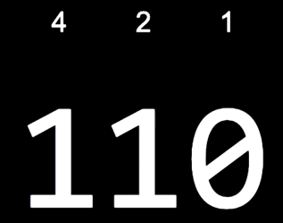
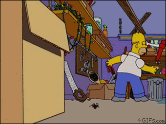

# CS50_ComputerScience_HarvardUniversity
Introduction to the intellectual enterprises of computer science and the art of programming. This course teaches students how to think algorithmically and solve problems efficiently. Topics include abstraction, algorithms, data structures, encapsulation, resource management, security, software engineering, and web programming.

- Usamos sistemas de representação em diversas situações da vida (contagem nos dedos, numeros, etc.)
- Nos computadores, usamos o sistema binário. Parece um retrocesso, mas ao usarmos bits, representamos a eletricidade física, que pode estar em dois estamos distindos
- 0 - Desligado
- 1 - Ligado

> 8 bits => 1 byte

Unicode foi criado para abranger outros caracteres não alfabéticos e símbolos de diferentes idiomas, visto que a representação binária consegue é limitada 128 combinações (128 bits). Acesse este site ~~feio~~ antigo para ver as possibilidades de combinações https://www.asciichart.com/.

Quando escrevemos programas usando algoritmos, geralmente nos preocupamos não apenas com o quão corretos eles são, mas também com o quão bem projetados eles são, considerando fatores como eficiência.

## C programming

> Não é necessário conhecer todos os detalhes da casa de um amigo a qual visitamos pela primeira vez, para que possamos nos localizar e entender em que cômodo estamos.

### Algumas definições importantes:

- **Função:** miniprograma, que recebe argumentos (parâmetros)
- **Efeito colateral:** retorno visual do resultado de uma função

- Para compilar: `make hello`
- Para executar: `./hello`

### Memória, imprecisão e estouro

Nossos programas usam essa RAM para armazenar dados enquanto estão em execução, mas essa memória é finita.

Acontece que isso é chamado de imprecisão de vírgula flutuante, em que não temos bits suficientes para armazenar todos os valores possíveis. Com um número finito de bits para um float , não podemos representar todos os números reais possíveis (dos quais existe um número infinito de), então o computador tem que armazenar o valor mais próximo que puder. E isso pode levar a problemas em que mesmo pequenas diferenças no valor se somam, a menos que o programador use alguma outra maneira para representar os valores decimais com a precisão necessária.

>caso tenhamos três bits e precisávamos contar mais do que sete (ou 111), adicionamos outro bit para obter oito, 1000 . **Mas se tivéssemos apenas três bits disponíveis**, não teríamos lugar para o 1 extra . Ele desapareceria e estaríamos de volta a 000. Esse problema é chamado de overflow (“vazamento”) de inteiro, pois um inteiro só pode atingir um tamanho especifico antes de ficar sem bits.

O bug do milênio foi ocasionado por causa de que o ano civil era armazenado em 2 bits. Mas aprendemos a lição? Claro que não.

Em 2038, também ficaremos sem bits para rastrear o tempo, já que há muitos anos alguns humanos decidiram usar 32 bits como o número padrão de bits para contar o número de segundos desde 1º de janeiro de 1970. Mas com 32 bits representando apenas números positivos, só podemos contar até cerca de quatro bilhões e, em 2038, atingiremos esse limite, a menos que atualizemos o software em todos os nossos sistemas de computador.

### Altoritmos Gulosos

> De acordo com o Instituto Nacional de Padrões e Tecnologia (NIST), um algoritmo ambicioso é aquele “que sempre pega a melhor solução imediata, ou local, enquanto encontra uma resposta. Algoritmos ambiciosos encontram a solução geral ou globalmente ideal para alguns problemas de otimização, mas podem encontrar soluções menos do que ideais para algumas instâncias de outros problemas.”

### Algoritmo de Luhn

A maioria dos cartões usa um algoritmo inventado por Hans Peter Luhn, da IBM. De acordo com o algoritmo de Luhn, você pode determinar se um número de cartão de crédito é (sintaticamente) válido da seguinte maneira:

1. Multiplique cada segundo digito por 2, começando com o penúltimo dígito do número e, em seguida, some os dígitos desses produtos.
2. Adicione essa soma à soma dos dígitos que não foram multiplicados por 2.
3. Se o último dígito do total for 0 (ou, mais formalmente, se o módulo total 10 for congruente com 0), o número é válido!

> Isso é meio confuso, então vamos tentar um exemplo com o cartão Visa do David: 4003600000000014.

1- Para fins de discussão, vamos primeiro sublinhar todos os outros dígitos, **começando com o penúltimo dígito do número**:
*4*0*0*3*6*0*0*0*0*0*0*0*0*0*1*4

Ok, vamos multiplicar cada um dos dígitos sublinhados por 2:

(1 • 2) + (0 • 2) + (0 • 2) + (0 • 2) + (0 • 2) + (6 • 2) + (0 • 2) + (4 • 2)

Isso nos dá: 2 + 0 + 0 + 0 + 0 + 12 + 0 + 8

Agora vamos adicionar **os dígitos desses produtos** (ou seja, não os próprios produtos):

2 + 0 + 0 + 0 + 0 + 1 + 2 + 0 + 8 = 13

2- Agora vamos adicionar essa soma (13) à soma dos dígitos que não foram multiplicados por 2 (começando do final):

13 + 4 + 0 + 0 + 0 + 0 + 0 + 3 + 0 = 20

3- Sim, o último dígito dessa soma (20) é 0, então o cartão de David é legítimo!

Portanto, validar números de cartão de crédito não é difícil, mas se torna um pouco tedioso manualmente. Vamos escrever um programa.

## Para saber mais

ascichart.com

## References

- Gifs by [giphy](https://giphy.com/).